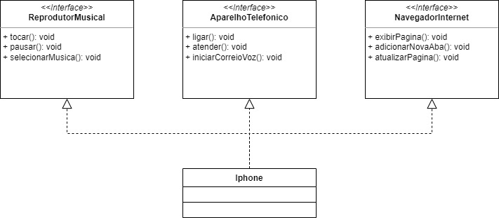

# Desafio-Projeto-UML
Desafio de Projeto do Bootcamp DIO "Desenvolvimento Java com Cloud AWS" - Diagramação de Classes do iPhone

Desenvolvimento do Desafio de Projeto proposto pelo professor [Gleyson Sampaio](https://github.com/glysns).

## ✒️Autor
- [Felipe Zanardo](https://github.com/FelipeBZanardo)

## 📋Descrição do Desafio

Chegou a hora de colocarmos em prática toda a concepção de análise de negócios, requisitos, conceitos da programação orientada a objetos e modelagem UML. Com base no vídeo de lançamento do iPhone conforme link abaixo, elabore em uma ferramenta de UML de sua preferência. A diagramação das classes e interfaces com a proposta de representar os papéis do iPhone de: Reprodutor Musical, Aparelho Telefônico e Navegador na Internet. Em seguida crie as classes e interfaces no formato de arquivos .java

Lançamento iPhone 2017

Agora é a sua vez de ser o protagonista! Implemente o desafio sugerido pela expert criando um repositório próprio e, com isso, aumentando ainda mais seu portfólio de projetos no GitHub!

## 📋  Pré-requisitos
- Lógica de programação e POO;
- Conhecimentos básicos(Java);
- Computador com SO de sua preferência(Windows, Linux, Mac OS);
- IDE (Visual Studio Code, Eclipse, etc);

## Diagrama UML 

  

## ⚙️ Executar o projeto:
1. Fazer o clone do repositório do projeto [Desafio-Projeto-UML](https://github.com/FelipeBZanardo/Desafio-Projeto-UML);
2. Abrir o projeto na sua IDE favorita (Sugestão: [IntelliJ](https://www.jetbrains.com/pt-br/idea/));
3. Run em "SmartPhone.main()".

## 🛠️ Tecnologias Utilizadas

* [IntelliJ](https://www.jetbrains.com/pt-br/idea/)
* [Draw.io](https://app.diagrams.net/)

## 📈 Melhorias futuras

- Implementar Model, Service e Repository para as ligações do "AparelhoTelefonico", para as músicas do "ReprodutorMusical";
- Usar banco de dados;
- Desenvolver ainda mais as implementações das interfaces para não só apenas escrever no console qual ação está sendo realizada.

